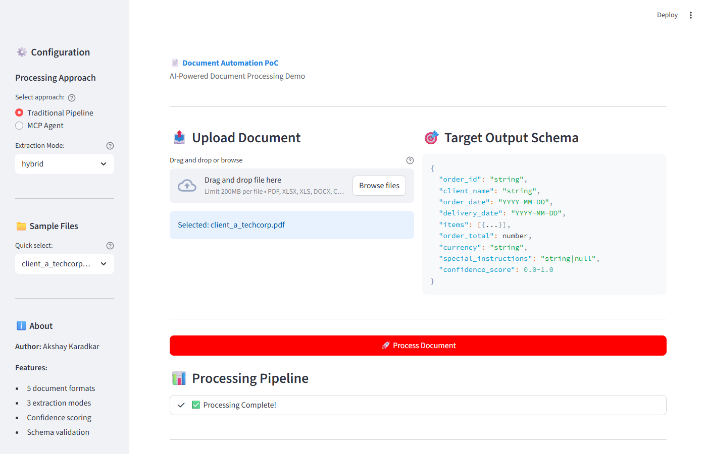

# Document Automation & Data Harmonization System

## AI-Powered Intelligent Document Processing

**Author:** Akshay Karadkar
**Date:** December 2024

---

## Demo


*Watch the webapp process a PDF document and extract structured data with confidence scoring*

---

## Overview

A production-ready document processing system that extracts structured data from multiple document formats (PDF, Excel, Word, CSV, scanned images) and outputs standardized JSON. The system demonstrates the evolution from simple rule-based parsing to sophisticated AI-powered extraction with an intelligent hybrid approach.



---

## The Evolution: From Rule-Based to AI-Powered

This project showcases **four stages of document processing maturity**, demonstrating when and why to use each approach:

### Stage 1: Rule-Based Parsing
**Fast, free, works for structured documents**

```python
# Uses pdfplumber, pandas, python-docx
pipeline = HybridPipeline(mode=ExtractionMode.RULE_BASED)
result = pipeline.process("structured_invoice.pdf")
# Speed: ~20ms | Cost: $0 | Accuracy: High for structured docs
```

**Best for:** Well-formatted PDFs, Excel files, CSVs with consistent structure

### Stage 2: AI-Only (GPT-4o)
**Handles any document including handwritten**

```python
# Uses GPT-4o Vision for understanding
pipeline = HybridPipeline(mode=ExtractionMode.AI_ONLY)
result = pipeline.process("handwritten_order.jpg")
# Speed: ~12s | Cost: $0.005 | Accuracy: Highest
```

**Best for:** Scanned documents, handwritten forms, complex layouts

### Stage 3: Hybrid Pipeline (Recommended)
**Best of both worlds - intelligent routing**

```python
# Rule-based first, AI fallback when needed
pipeline = HybridPipeline(mode=ExtractionMode.HYBRID)
result = pipeline.process("any_document")
# Speed: ~9s avg | Cost: $0.001 avg | Accuracy: High
```

### Stage 4: MCP Agent Architecture
**Natural language interface with tool-calling**

```python
from agent import DocumentAgent

agent = DocumentAgent()
result = agent.process("Process all PDFs and compare extraction modes")
# Agent reasons about the task, calls appropriate tools
```

**Best for:** Complex workflows, batch processing, integration with other systems

---

## Features

- **5 Document Formats**: PDF, Excel (.xlsx/.xls), Word (.docx), CSV, Scanned images
- **3 Extraction Modes**: rule_based, ai_only, hybrid
- **Confidence Scoring**: 0.0-1.0 with auto-approve thresholds
- **Schema Validation**: Pydantic v2 for type-safe outputs
- **Interactive Webapp**: Streamlit-based visual demo
- **MCP Agent**: Tool-calling for natural language processing

---

## Quick Start

### 1. Clone and Install

```bash
# Clone the repository
git clone https://github.com/akshaykaradkar/multi-format-document-extractor.git
cd multi-format-document-extractor

# Create virtual environment
python -m venv venv
source venv/bin/activate  # Linux/Mac
venv\Scripts\activate     # Windows

# Install dependencies
pip install -r requirements.txt
```

### 2. Configure API Key

```bash
# Copy example environment file
cp .env.example .env

# Edit .env and add your OpenAI API key
OPENAI_API_KEY=sk-your-key-here
```

> **Note:** OpenAI API key is only required for AI-only and hybrid modes. Rule-based mode works without it.

### 3. Create Sample Files

```bash
python main.py --create-samples
```

### 4. Run the CLI Demo

```bash
# Process all sample files
python main.py

# Process a single file
python main.py --file sample_data/client_a_techcorp.pdf
```

### 5. Run the Web Application

```bash
# Start the Streamlit webapp
python run_webapp.py

# Or directly with streamlit
streamlit run webapp/app.py
```

Open http://localhost:8501 in your browser.

---

## Webapp Tutorial

The interactive webapp provides a visual demonstration of the document processing pipeline:

### Step 1: Select Processing Approach
Choose between:
- **Traditional Pipeline**: Direct processing with rule_based/ai_only/hybrid modes
- **MCP Agent**: Natural language interface with tool-calling

### Step 2: Choose Extraction Mode
- **rule_based**: Fastest, uses local parsers only
- **ai_only**: Most accurate, uses GPT-4o for all extraction
- **hybrid**: Recommended - tries rule-based first, falls back to AI

### Step 3: Upload or Select Document
- Drag and drop any supported file
- Or use the sample files provided

### Step 4: Process and View Results
- Watch the live pipeline progress
- View extracted JSON matching the target schema
- Check confidence score and validation status
- Download the results

---

## Benchmark Results

```
================================================================================
OVERALL SUMMARY (5 Documents Tested)
================================================================================

Mode            Success    Failed     Avg Time        Total Cost
-----------------------------------------------------------------
rule_based      4          1          19ms            $0.0000
ai_only         5          0          12680ms         $0.0250
hybrid          5          0          8993ms          $0.0050

KEY INSIGHT: Hybrid achieves 100% success at 80% lower cost than AI-only
```

---

## Output Schema

All documents are transformed to this standardized JSON format:

```json
{
  "order_id": "PO-2024-001234",
  "client_name": "TechCorp Industries",
  "order_date": "2024-03-15",
  "delivery_date": "2024-03-22",
  "items": [
    {
      "product_code": "WDG-001",
      "description": "Industrial Widget A",
      "quantity": 100,
      "unit_price": 25.00,
      "total_price": 2500.00
    }
  ],
  "order_total": 5250.00,
  "currency": "USD",
  "special_instructions": "Deliver to Loading Dock B",
  "confidence_score": 0.92
}
```

### Confidence Scoring

| Score | Status | Action |
|-------|--------|--------|
| >= 0.90 | HIGH | Auto-approve |
| 0.70-0.89 | MEDIUM | Review recommended |
| < 0.70 | LOW | Manual review required |

---

## Architecture

```
Document Input
      |
      v
+------------------+
| Format Detection |
+--------+---------+
         |
    +----+----+
    |         |
    v         v
+-------+ +-------+
| Local | |  LLM  |
| Parse | |(GPT-4)|
+---+---+ +---+---+
    |         |
    +----+----+
         |
         v
+------------------+
| Field Normalizer |
| & Transformer    |
+--------+---------+
         |
         v
+------------------+
| Schema Validator |
| (Pydantic)       |
+--------+---------+
         |
         v
+------------------+
| Confidence Score |
+--------+---------+
         |
         v
  Standardized JSON
```

---

## Project Structure

```
document-automation/
├── docs/
│   ├── images/
│   │   └── webapp_screenshot.png    # Webapp demo screenshot
│   ├── PRD.md                       # Product Requirements
│   ├── TECHNICAL_ARCHITECTURE.md    # System Design
│   ├── IMPLEMENTATION_STRATEGY.md   # Rollout Plan
│   ├── BUSINESS_CASE.md             # ROI Analysis
│   └── PRESENTATION.md              # Executive Summary
├── src/
│   ├── config.py                    # Configuration & settings
│   ├── schemas.py                   # Pydantic models
│   ├── pipeline.py                  # Main orchestrator
│   ├── hybrid_pipeline.py           # 3-mode extraction pipeline
│   ├── parsers/
│   │   ├── base_parser.py           # Abstract base class
│   │   ├── pdf_parser.py            # PDF (pdfplumber)
│   │   ├── excel_parser.py          # Excel (pandas + openpyxl)
│   │   ├── word_parser.py           # Word (python-docx)
│   │   ├── csv_parser.py            # CSV (pandas)
│   │   └── ocr_parser.py            # OCR (GPT-4o Vision)
│   ├── processors/
│   │   ├── data_transformer.py      # Field normalization
│   │   ├── llm_extractor.py         # LLM-based extraction
│   │   └── confidence_scorer.py     # Quality scoring
│   └── validators/
│       └── schema_validator.py      # Pydantic validation
├── mcp_server/
│   ├── server.py                    # FastMCP server
│   └── tools.py                     # MCP tool implementations
├── agent/
│   ├── orchestrator.py              # OpenAI function-calling agent
│   └── prompts.py                   # System prompts
├── webapp/
│   ├── app.py                       # Streamlit application
│   └── components/                  # UI components
├── sample_data/                     # Test documents (5 clients)
├── output/                          # Generated JSON files
├── main.py                          # CLI entry point
├── run_webapp.py                    # Webapp launcher
├── compare_modes.py                 # Mode comparison utility
└── requirements.txt                 # Dependencies
```

---

## Requirements

### Python Version
- Python 3.11+

### Core Dependencies

| Package | Version | Purpose |
|---------|---------|---------|
| `openai` | >=1.40.0 | GPT-4o for AI extraction |
| `pdfplumber` | >=0.10.0 | PDF table extraction |
| `pandas` | >=2.0.0 | Excel/CSV processing |
| `openpyxl` | >=3.1.0 | Excel file support |
| `python-docx` | >=1.1.0 | Word document parsing |
| `pydantic` | >=2.0.0 | Schema validation |
| `Pillow` | >=10.0.0 | Image processing |
| `python-dotenv` | >=1.0.0 | Environment variables |
| `streamlit` | >=1.28.0 | Web application |
| `fastmcp` | >=2.0.0 | MCP server (optional) |

### Install All Dependencies

```bash
pip install -r requirements.txt
```

---

## API Usage

### Basic Processing

```python
from src.pipeline import process_document

result = process_document("order.pdf", save_output=True)

if result["success"]:
    order = result["order"]
    print(f"Order ID: {order['order_id']}")
    print(f"Confidence: {result['confidence']:.2f}")
```

### Using Hybrid Pipeline

```python
from src.hybrid_pipeline import HybridPipeline, ExtractionMode

# Rule-based only (fastest)
pipeline = HybridPipeline(mode=ExtractionMode.RULE_BASED)

# AI only (most accurate)
pipeline = HybridPipeline(mode=ExtractionMode.AI_ONLY)

# Hybrid (recommended)
pipeline = HybridPipeline(mode=ExtractionMode.HYBRID)

result = pipeline.process("document.pdf")
print(f"Extracted: {result.order.model_dump_json(indent=2)}")
```

### Using MCP Agent

```python
from agent import DocumentAgent

agent = DocumentAgent()
result = agent.process("Process client_a_techcorp.pdf with hybrid mode")
print(result)
```

---

## Configuration

### Environment Variables

| Variable | Description | Required |
|----------|-------------|----------|
| `OPENAI_API_KEY` | OpenAI API key | For AI modes |
| `OPENAI_VISION_MODEL` | Vision model name | Optional (default: gpt-4o) |

### Confidence Thresholds

Edit `src/config.py`:

```python
CONFIDENCE_THRESHOLDS = {
    "high": 0.9,      # Auto-approve
    "medium": 0.7,    # Review recommended
}
```

---

## Documentation

| Document | Description |
|----------|-------------|
| [Technical Architecture](docs/TECHNICAL_ARCHITECTURE.md) | System design, components, data flow |
| [Implementation Strategy](docs/IMPLEMENTATION_STRATEGY.md) | Phased rollout, client onboarding |
| [Business Case](docs/BUSINESS_CASE.md) | ROI analysis, risk assessment |
| [PRD](docs/PRD.md) | Product requirements specification |
| [Presentation](docs/PRESENTATION.md) | Executive summary slides |

---

## License

MIT License

---

## Author

**Akshay Karadkar**
