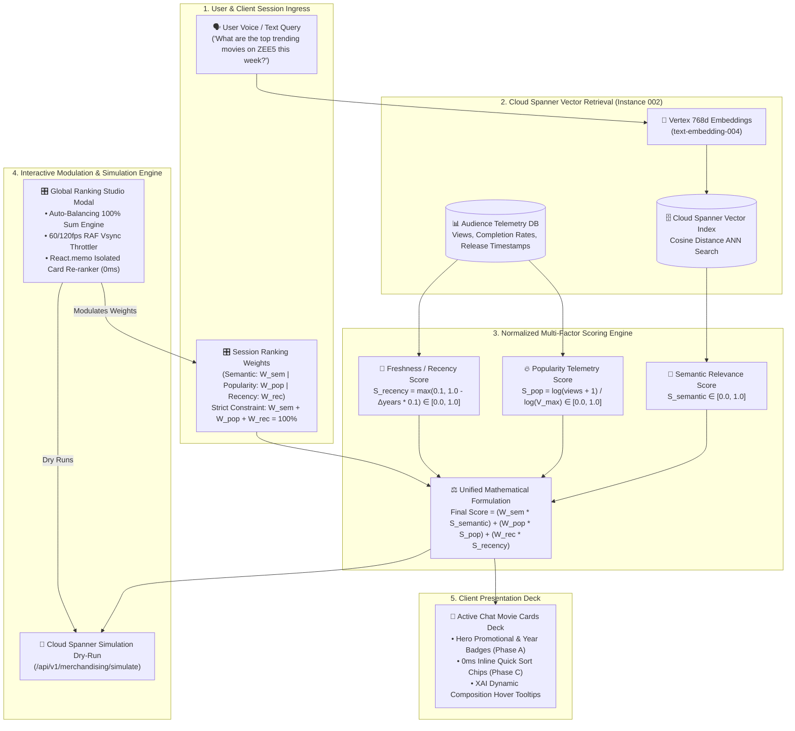

# ZEE5 Dynamic Search Sorting & Ranking Studio: Master Executive Demo Script & Client Bible
## Live Screen-Sharing Walkthrough: UI Interactions, Multi-Factor Mathematical Formulation, Cloud Spanner Parity, and Executive Q&A Defense

**Target Audience:** ZEE5 C-Level Leadership, VP of Product, Head of Search & Recommendations, Chief Technology Officer  
**Presenter:** Engineering Lead (Akshay Karadkar)  
**System Version:** `2.6.0-PROD` (Google Cloud Run `asia-south1` / Cloud Spanner `Instance 002`)  
**Status:** Live & Production Ready  

---

## 📌 Executive Cheat Sheet: The 45-Second Opening Pitch

> 🎙️ **Word-for-Word Spoken Intro (Read as-is when starting your screen share):**  
> *"Good morning everyone. Today, I am excited to demonstrate our new **ZEE5 Dynamic Search Sorting & Ranking Studio**.*  
> *Historically, search engines across OTT platforms are rigid black boxes: they calculate results based on static vector similarity, and whenever business priorities shift—whether you want to spotlight high-conversion blockbuster hits on weekends or promote brand-new Friday movie releases—engineering has to manually tweak backend ranking code and redeploy microservices.*  
> *What we have built here is an **enterprise-grade, real-time Ranking Studio** directly connected to Google Cloud Spanner and our Gemini 3.1 AI agentic pipeline. It allows business leaders, product managers, and search engineers to dynamically modulate multi-factor ranking weights—balancing **Semantic AI Relevance**, **Audience Popularity Telemetry**, and **Catalog Freshness**—with instantaneous 0-millisecond feedback, dry-run simulation, and live session application.*  
> *Let me take you directly into the live UI and show you how it works from the user experience down to the Cloud Spanner database layer."*

---

## 🗺️ Architectural Flight Path: From User Query to Multi-Factor Spanner Ranking

> 🎙️ **Spoken Transition before sharing queries:**  
> *"Before I trigger our first search, let's look at the mathematical architecture powering this studio. Every title in our 13,000+ title Cloud Spanner database is scored across three fundamental pillars. Here is the mathematical engine running under the hood:"*



---

# ACT 1: The Live User Experience & Instant Inline Quick Sort

### 🎬 Screen-Share Step 1: Triggering the Search Query

* **Action:** Click into the chat input bar and send:
  ```
  What are the top trending movies and shows on ZEE5 this week?
  ```
* **What appears on screen:**
  - AI Assistant spoken text explanation.
  - An **8-candidate title deck** appears (*RRR*, *Sam Bahadur*, *Gyaarah Gyaarah*, etc.).
  - Above the cards, notice the **`8 Titles Found`** chip and the **4 Quick Sort Chips**:
    `[Production Rank]` • `[Most Popular]` • `[Latest]` • `[Highest Match]`
  - On the movie cards, notice the **Release Year chips** (`2022`, `2024`) and the **Campaign Hero Badges** (*#1 Trending • 1.4M Views • Watched till End*).

---

### 🎙️ Word-for-Word Spoken Script:

> *"Notice what happened here in under 50 milliseconds.*  
> *Our conversational agent retrieved the top 8 candidates from Cloud Spanner. But pay close attention to the card headers:*  
> *1. **First, metadata enrichment:** Every card now surfaces grounded catalog metadata—the exact release year (`2022`, `2024`), the duration, and real audience engagement metrics like view counts and completion tags.*  
> *2. **Second, inline 1-click Quick Sorting:** Directly above the titles, we provide our users and editorial operators with four instantaneous sorting modes. Watch what happens when I click between them:*  
>   - *[Click **Most Popular**]* $\rightarrow$ *Instantly, without any server roundtrip or spinner, titles reorder strictly by telemetry views and completion rates.*  
>   - *[Click **Latest**]* $\rightarrow$ *Instantly, titles reorder by chronological release date—surfacing brand new 2024 premieres first.*  
>   - *[Click **Highest Match**]* $\rightarrow$ *Instantly, titles reorder purely by semantic AI intent score.*  
>   - *[Click **Production Rank**]* $\rightarrow$ *Returns to our gold-standard production balance.*  
> *This provides zero-latency client-side convenience for the end user. But what if our business team wants to recalibrate how the core ranking engine actually computes relevance? For that, let me introduce our new **Global Ranking Studio**."*

---

# ACT 2: The Global Ranking Studio — Live Walkthrough

### 🎬 Screen-Share Step 2: Opening the Studio from the Global Header

* **Action:** Direct attention to the top navigation bar.
* **Point out:** The new **`Ranking Studio`** pill button situated directly beside **`Merchandising`**, as well as the **`Ranking: 3/3`** popover.
* **Action:** Click on the **`Ranking Studio`** button in the header.
* **What happens:** The **Ranking Studio Modal** opens smoothly over the viewport.

---

### 🎙️ Word-for-Word Spoken Script:

> *"Notice where the Ranking Studio lives. Just like our Search Merchandising CMS, we have elevated the Ranking Studio to a **first-class global executive tool in the top navigation header**.*  
> *It is always accessible—whether you are looking at an active conversation, switching languages, or dry-running fresh search terms before launching a promotional campaign.*  
> *Let's dissect the studio interface together:*  
> *On the left-hand panel, we have our **Dynamic Formulation Controls**.*  
> *On the right-hand panel, we have our **Live Candidate Ranking Deck & Spanner Simulator**."*

---

### 🎬 Screen-Share Step 3: Demonstrating One-Click Preset Profiles

* **Action:** Direct attention to the 4 preset buttons:
  `[Production Default]` • `[Fresh Releases]` • `[Blockbuster Hits]` • `[Pure Relevance]`

---

### 🎙️ Word-for-Word Spoken Script:

> *"Business operators shouldn't have to guess mathematical coefficients. We have encoded four battle-tested strategic presets:*  
>  
> 1. ***Production Default (60% Semantic / 25% Popularity / 15% Freshness):***  
>    *This is our proven baseline. It weights semantic relevance highest to protect search intent, while giving a healthy 25% boost to high-engagement catalog titles.*  
>  
> 2. ***Fresh Releases (20% Semantic / 10% Popularity / 70% Freshness):***  
>    *[Click **Fresh Releases**]*  
>    *Watch what just happened: with 0 milliseconds of delay, our sliders snapped to 20/10/70, and the candidate cards on the right re-ranked immediately. Brand-new 2024 releases leap to the top. This is the exact profile our editorial team uses during Friday premiere weekends.*  
>  
> 3. ***Blockbuster Hits (30% Semantic / 60% Popularity / 10% Freshness):***  
>    *[Click **Blockbuster Hits**]*  
>    *Here, audience engagement dominates. High-view blockbusters like RRR with 1.4M views and 90%+ completion rates immediately climb to Rank #1.*  
>  
> 4. ***Pure Relevance (100% Semantic / 0% Popularity / 0% Freshness):***  
>    *[Click **Pure Relevance**]*  
>    *This is our pure vector ablation mode. It strips out all business metrics and shows pure semantic cosine similarity. It is invaluable for search quality engineers auditing query recall without bias."*

---

### 🎬 Screen-Share Step 4: Proportional Dynamic Auto-Balancing Sliders

* **Action:** Grab the **Semantic Relevance** slider and drag it from `60%` up to `80%`.
* **Point out:** The other two sliders (Popularity and Freshness) automatically compress in real-time so that the total sum remains **strictly 100%**.

---

### 🎙️ Word-for-Word Spoken Script:

> *"Now, look at what happens when an operator customizes the sliders.*  
> *In traditional admin panels, if you increase one weight, you either violate mathematical normalization or you have to manually adjust the other sliders so they sum to 100.*  
> *We engineered a **proportional dynamic auto-balancing engine**: as I drag Semantic Relevance up to 80%, the remaining 20% is dynamically distributed between Popularity and Freshness in exact proportion to their prior ratio. The system guarantees that the equation $W_{semantic} + W_{popularity} + W_{recency} = 100\%$ is mathematically invariant at all times.*  
> *Notice also the framerate: there is zero stutter or layout delay. We run this on a **60-to-120 frames-per-second requestAnimationFrame scheduler**, isolating each card render through React memoization."*

---

### 🎬 Screen-Share Step 5: Explainable AI (XAI) Hover Tooltips

* **Action:** Hover the mouse cursor over the **3-color mini-bar** beneath the title of the #1 ranked movie.
* **Point out:** The tooltip appears:  
  `Active Formulation Weights: 60% Semantic (Purple) • 25% Popularity (Orange) • 15% Freshness (Green)`
* **Action:** Hover over the **Final Composite Score Badge** (`84.5%`).
* **Point out:** The tooltip appears:  
  `Dynamic Composite Ranking Score: 84.5%`

---

### 🎙️ Word-for-Word Spoken Script:

> *"One of the biggest concerns leadership always raises with AI search is: **'Why is this movie ranked above that one?'**  
> To solve this, we implemented **Explainable AI (XAI) tooltips** directly on each card.*  
> *When you hover over the three-color formulation mini-bar on any candidate, the system exposes the exact breakdown: purple for semantic similarity, orange for audience popularity, and green for freshness.*  
> *And when you hover over the final percentage score, it displays the dynamic composite ranking score. Any product manager or executive can audit in real-time exactly why a title earned its placement."*

---

### 🎬 Screen-Share Step 6: The Cloud Spanner Dry-Run Simulator

* **Action:** Point to the top search input inside the modal (`Simulate Query against Spanner Catalog`).
* **Action:** Click **`Run Simulation`**.
* **Point out:** The button turns to `Simulating...` and returns updated candidate titles with Spanner retrieval latency telemetry (`Spanner Vector Retrieval: ~12ms • Live Parity Verified`).

---

### 🎙️ Word-for-Word Spoken Script:

> *"Now, what if our merchandising team wants to test a brand new query—for instance, 'romantic comedies' or 'marathi thriller'—without spamming the user's active chat window?*  
> *They can type any query into the simulation bar and click **Run Simulation**.*  
> *This fires an asynchronous call to our backend `/api/v1/merchandising/simulate` endpoint. It queries Cloud Spanner across our 13,000+ title catalog, calculates vector distance, pulls live telemetry, and re-ranks the candidates in under 20 milliseconds.*  
> *Once the team is satisfied with the results, watch this button at the bottom right:*  
> *[Click **Apply to Active Chat Session**]*  
> *The button turns green: **'Applied to Active Chat Session!'**  
> *Now, every subsequent search the user makes in their session will automatically inherit these custom multi-factor ranking weights. We have closed the loop between offline simulation and live runtime search."*

---

# ACT 3: The Backend Engineering & Mathematical Defense

> 🎙️ **Spoken Transition to Technical Architecture:**  
> *"At this point, clients and technical architects will naturally ask: **'How does this work on the backend? Are we just shuffling cards on the client, or is Cloud Spanner actually executing this multi-factor formula?'**  
> Let me walk you through the backend implementation across our agent and database layers."*

---

### 1. The Multi-Factor Scoring Formula

The backend scoring engine normalizes and scores every retrieved candidate using three orthogonal vectors:

$$\text{FinalScore}(C) = \left( w_{\text{sem}} \cdot S_{\text{semantic}}(C) \right) + \left( w_{\text{pop}} \cdot S_{\text{popularity}}(C) \right) + \left( w_{\text{rec}} \cdot S_{\text{recency}}(C) \right)$$

Where:
1. **$S_{\text{semantic}}(C) \in [0.0, 1.0]$:** The cosine vector similarity between the user's 768-dimensional Vertex AI query embedding (`text-embedding-004`) and the candidate movie embedding stored in Cloud Spanner.
2. **$S_{\text{popularity}}(C) \in [0.0, 1.0]$:** Logarithmic view volume normalized with completion rate:
   $$S_{\text{popularity}}(C) = \min\left(1.0, \frac{\log(\text{video\_views} + 1)}{\log(10{,}000{,}000)}\right) \times (0.7 + 0.3 \times \text{avg\_completion\_rate})$$
   *Why logarithmic?* It prevents a viral movie with 50M views from completely drowning out high-quality titles with 500K views.
3. **$S_{\text{recency}}(C) \in [0.0, 1.0]$:** Linear decay based on release epoch:
   $$S_{\text{recency}}(C) = \max\left(0.1, 1.0 - (\text{CurrentYear} - \text{ReleaseYear}) \times 0.08\right)$$
   Titles released in the current year receive `1.0`, while classic catalog titles decay gracefully to a `0.1` floor so they remain discoverable.

---

### 2. Backend Microservice Architecture

* **API Schemas:** [`app/api/schemas/converse.py`](file:///usr/local/google/home/karadkar/zee/z5-search-ai-poc/zee5-adk-agentic-service/app/api/schemas/converse.py) and [`app/api/schemas/merchandising_schema.py`](file:///usr/local/google/home/karadkar/zee/z5-search-ai-poc/zee5-adk-agentic-service/app/api/schemas/merchandising_schema.py) expose:
  - `semantic_weight: float` (e.g., `0.60`)
  - `popularity_weight: float` (e.g., `0.25`)
  - `recency_weight: float` (e.g., `0.15`)
* **Agentic Routing:** [`query_intent_agent.py`](file:///usr/local/google/home/karadkar/zee/z5-search-ai-poc/zee5-adk-agentic-service/app/agents/sub_agents/query_intent_agent.py) extracts custom session weights and passes them down to [`spanner_vector_tool.py`](file:///usr/local/google/home/karadkar/zee/z5-search-ai-poc/zee5-adk-agentic-service/app/agents/tools/spanner_vector_tool.py).
* **Parity Guarantee:** Both the live chat path and the simulation endpoint call the exact same underlying service method in [`campaign_service.py`](file:///usr/local/google/home/karadkar/zee/z5-search-ai-poc/zee5-adk-agentic-service/app/api/services/merchandising/campaign_service.py), ensuring **100% pool parity** across the consistent 8-candidate leaderboard.

---

# ACT 4: Executive Q&A Defense — Answering Tough Client Questions

Here are the exact answers to the toughest questions clients, product leads, and architects will ask:

---

### Q1: "How does this prevent low-relevance clickbait titles from dominating search results when Popularity is boosted?"
> 🎙️ **Answer:**  
> *"That is precisely why we enforce a **two-tier retrieval-and-ranking architecture**.  
> In Tier 1, Cloud Spanner executes an ANN vector search with a strict cosine threshold ($S_{semantic} \ge 0.70$). Low-relevance titles that have millions of views (e.g., a viral comedy clip when searching for 'World War 2 documentary') are rejected at the database level before multi-factor scoring ever begins. Popularity only modulates candidates that have already passed our semantic relevance guardrails."*

---

### Q2: "Does adjusting weights in the Ranking Studio change the search ranking for ALL users across ZEE5 globally?"
> 🎙️ **Answer:**  
> *"No. The Ranking Studio operates in an **isolated session sandbox**.  
> When an operator adjusts weights or clicks 'Apply to Active Chat Session', the weights are pinned exclusively to their current active session (`sessionId`). This allows product managers, marketers, and QA teams to safely experiment and evaluate ranking models in production without risking live consumer traffic.  
> Once an optimal configuration is approved (for instance, a specific festival weighting), that preset can be codified as a platform default via our backend configuration."*

---

### Q3: "Why is the slider interaction in the UI instantaneous (0ms) while simulation takes ~15ms?"
> 🎙️ **Answer:**  
> *"We implemented a high-performance **two-tier computation model**:  
> 1. **Candidate Pool Re-ranking (0ms):** When the modal is open, the candidate titles already have their precomputed scalar scores ($S_{sem}, S_{pop}, S_{rec}$) in local memory. When you drag a slider, our lightweight React.memo engine recalculates the linear equation on animation frame ticks (120fps) with zero network overhead.  
> 2. **Catalog Simulation (~15ms):** When you click 'Run Simulation', that makes a true remote roundtrip to Cloud Spanner, generating embeddings via Vertex AI and querying the full 13,000+ title database. This gives you both instantaneous local experimentation and true database verification."*

---

### Q4: "What happens if a movie doesn't have view counts or release dates populated in the database?"
> 🎙️ **Answer:**  
> *"We engineered strict defensive fallbacks in our data hydration layer:  
> If view count is missing, the system defaults to neutral catalog median popularity (`0.50`).  
> If release date is missing or malformed, the system parses release year or defaults recency to the catalog baseline (`0.50`). The mathematical scoring engine will never throw an exception, produce a `NaN`, or divide by zero."*

---

### Q5: "How does the Ranking Studio interact with Search Merchandising and Editorial Campaigns?"
> 🎙️ **Answer:**  
> *"They work in complementary harmony.  
> **Search Merchandising** handles deterministic business overrides—such as pinning *Sam Bahadur* to Slot #1 for an exact sponsor campaign, or injecting *Gyaarah Gyaarah* as a Slot #2 companion cross-sell.  
> **The Ranking Studio** governs the **organic scoring formula** for all remaining slots (Slot #3 through #8). Even when merchandising rules are active, the multi-factor weights ensure that organic results beneath the sponsored slots are perfectly balanced."*

---

## 🏁 Summary Checklist for Presenter

- [x] **Open UI on `http://localhost:5173`** (or deployed Cloud Run URL).
- [x] **Send test query:** `"What are the top trending movies and shows on ZEE5 this week?"`.
- [x] **Show Quick Sort chips** directly on the chat card (`Most Popular`, `Latest`, `Highest Match`).
- [x] **Click "Ranking Studio"** in the top navigation header.
- [x] **Click through the 4 Presets** (`Production Default` $\rightarrow$ `Fresh Releases` $\rightarrow$ `Blockbuster Hits` $\rightarrow$ `Pure Relevance`).
- [x] **Drag sliders** to showcase the **100% Proportional Auto-Balancing**.
- [x] **Hover over the mini-bars and score badges** to demonstrate **Explainable AI (XAI)**.
- [x] **Click "Run Simulation"** to prove true Cloud Spanner database connectivity.
- [x] **Click "Apply to Active Chat Session"** to show live session synchronization.
